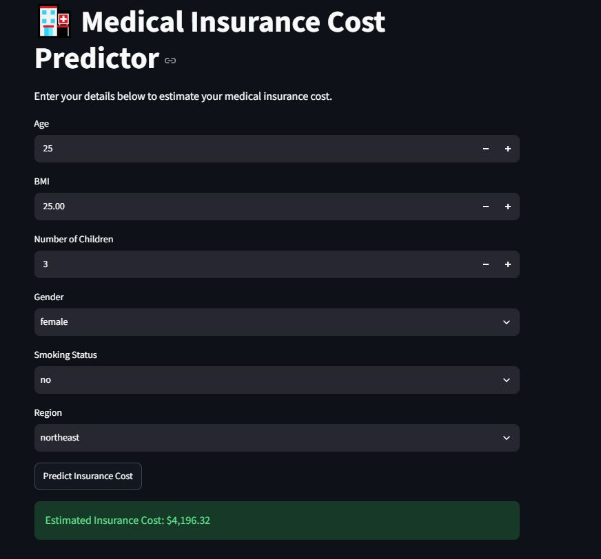

# Medical Insurance Cost Prediction

## About the Project

This is a machine learning project I made to predict medical insurance charges based on a few personal details.

The main idea was to take information such as age, BMI, smoking status, number of children, gender, and region and use it to estimate the insurance cost.

I built this project as part of my learning experience with Python, data preprocessing, and machine learning.

## Dataset

I used the Medical Cost Personal Dataset.

The dataset contains information about:

- Age
- Sex
- BMI
- Number of children
- Smoking status
- Region
- Insurance charges

The value I wanted to predict was `charges`.

## What I Did

I went through the following steps:

1. Loaded the dataset using Pandas.
2. Checked the data and its structure.
3. Checked for missing values and duplicate rows.
4. Looked at the different data types.
5. Converted the categorical columns into numerical values.
6. Separated the input features from the target (`charges`).
7. Split the data into training and testing sets.
8. Trained a Multiple Linear Regression model.
9. Tested the model using the test data.
10. Built a small application that takes user input and predicts the estimated insurance cost.

## Model

For this project, I used **Multiple Linear Regression**.

The model takes these factors as input:

- Age
- BMI
- Number of children
- Sex
- Smoking status
- Region

and predicts the estimated insurance charge.

## Model Evaluation

I evaluated the model using four metrics:

- MAE
- MSE
- RMSE
- R² Score

| Metric | Result |
|---|---:|
| MAE | 4181.19 |
| MSE | 33,596,915.85 |
| RMSE | 5,796.28 |
| R² Score | 0.7836 |
My results were:

| Metric | Result |
|---|---|
| MAE | Add your result |
| MSE | Add your result |
| RMSE | Add your result |
| R² Score | Add your result |

## Prediction App

I also created a simple web application where users can enter their details and get an estimated medical insurance cost.

The app takes:

- Age
- BMI
- Smoking status
- Number of children
- Gender
- Region

and uses the trained machine learning model to make the prediction.

### Live App

You can try the prediction app here:

 [Medical Insurance Cost Predictor](PASTE-YOUR-STREAMLIT-URL-HERE)

### Screenshots
#### App Interface

#### Prediction Result

## Technologies I Used

- Python
- Pandas
- NumPy
- Scikit-learn
- Gradio
- Google Colab
- GitHub

## Limitations

This model only gives an estimated insurance cost. The prediction may not be accurate for every person because it depends on the dataset used for training.

Also, I used Linear Regression for this project, so there may be other models that could give different results.

## Project Files

`app.py` - code for the prediction application

`insurance_model.pkl` - trained machine learning model

`requirements.txt` - libraries required to run the application
